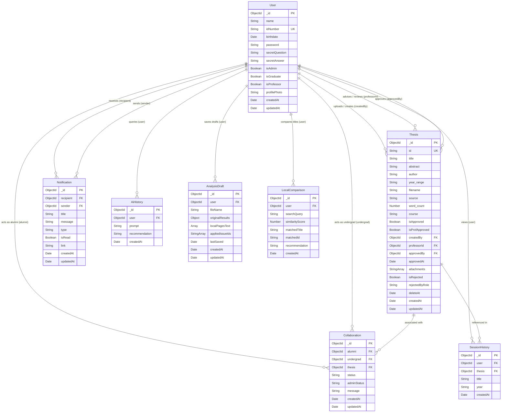

# Entity-Relationship Diagram (ERD) & Database Schema Documentation

This document provides a comprehensive overview of the MongoDB database schema and relationships for the TUPT-Thesis system.

---

## 1. Entity-Relationship Diagram (Mermaid)

Below is the visual relationship map between the different MongoDB collections.

---

## 2. Collection Schemas & Data Dictionary

### 2.1 User Collection (`users`)
Stores the credentials, profile information, and roles of all system participants.

| Field Name | Data Type | Constraints / Defaults | Description |
| :--- | :--- | :--- | :--- |
| `_id` | `ObjectId` | Primary Key, Auto-generated | Unique identifier for the user. |
| `name` | `String` | Required, Max 100 chars, Trimmed | Full name of the user. |
| `idNumber` | `String` | Required, Unique, Max 50 chars, Trimmed | Identification number (student/faculty ID). |
| `birthdate` | `Date` | Optional, Custom Validator | Birthdate of the user (requires age >= 18). |
| `password` | `String` | Required, Min 6 chars, Hashed | Bcrypt hashed password. |
| `secretQuestion` | `String` | Default: `null` | Security question for password recovery. |
| `secretAnswer` | `String` | Default: `null`, Hashed | Bcrypt hashed answer to the secret question. |
| `isAdmin` | `Boolean` | Default: `false` | True if the user has administrative privileges. |
| `isGraduate` | `Boolean` | Default: `false` | True if the user is an alumnus/graduate. |
| `isProfessor` | `Boolean` | Default: `false` | True if the user is a faculty member. |
| `profilePhoto` | `String` | Default: `null` | URL path to the user's uploaded profile photo. |
| `createdAt` | `Date` | Timestamp (Auto-generated) | Record creation timestamp. |
| `updatedAt` | `Date` | Timestamp (Auto-generated) | Record last update timestamp. |

---

### 2.2 Thesis Collection (`theses`)
Holds all metadata, document information, status flags, and ownership references for academic theses.

| Field Name | Data Type | Constraints / Defaults | Description |
| :--- | :--- | :--- | :--- |
| `_id` | `ObjectId` | Primary Key, Auto-generated | Unique document identifier. |
| `id` | `String` | Required, Unique, Indexed | Public-facing unique identifier for search/retrieval. |
| `title` | `String` | Required, Text Index (Weight: 10) | Title of the thesis. |
| `abstract` | `String` | Required, Text Index (Weight: 2) | Abstract/summary of the thesis contents. |
| `author` | `String` | Default: `'Academic Research Group'`, Text Index (Weight: 5) | Author(s) of the thesis. |
| `year_range` | `String` | Default: `'unknown'` | Academic year or range. |
| `filename` | `String` | Optional | Original filename of the uploaded thesis document. |
| `source` | `String` | Default: `'ocr'` | Upload source or extraction type (e.g., `'ocr'`). |
| `word_count` | `Number` | Optional | Total word count of the thesis text. |
| `course` | `String` | Default: `'General'` | Academic course or department acronym (e.g., `'BSIT'`, `'BSCE'`). |
| `isApproved` | `Boolean` | Default: `false` | Flag indicating final librarian/admin approval. |
| `isProfApproved` | `Boolean` | Default: `false` | Flag indicating advising professor approval. |
| `createdBy` | `ObjectId` | Ref: `User` | Foreign Key referencing the undergraduate student creator. |
| `professorId` | `ObjectId` | Ref: `User` | Foreign Key referencing the assigned reviewing professor. |
| `approvedBy` | `ObjectId` | Ref: `User` | Foreign Key referencing the administrator/librarian who approved the thesis. |
| `approvedAt` | `Date` | Optional | Date and time the thesis was approved. |
| `attachments` | `[String]` | Array | Cloudinary URLs pointing to supporting documentation. |
| `isRejected` | `Boolean` | Default: `false` | Flag indicating if the thesis submission was rejected. |
| `rejectedByRole`| `String` | Enum: `['faculty', 'librarian']` | The role of the reviewer who rejected the thesis. |
| `deleteAt` | `Date` | TTL Index (expireAfterSeconds: 0) | Expiration date for automatic deletion of rejected documents. |
| `createdAt` | `Date` | Timestamp (Auto-generated) | Record creation timestamp. |
| `updatedAt` | `Date` | Timestamp (Auto-generated) | Record last update timestamp. |

---

### 2.3 Collaboration Collection (`collaborations`)
Manages thesis collaboration requests between alumni/graduates and undergraduate students.

| Field Name | Data Type | Constraints / Defaults | Description |
| :--- | :--- | :--- | :--- |
| `_id` | `ObjectId` | Primary Key, Auto-generated | Unique record identifier. |
| `alumni` | `ObjectId` | Required, Ref: `User` | Foreign Key pointing to the alumni user requestor/participant. |
| `undergrad` | `ObjectId` | Required, Ref: `User` | Foreign Key pointing to the undergraduate student participant. |
| `thesis` | `ObjectId` | Required, Ref: `Thesis` | Foreign Key referencing the associated thesis. |
| `status` | `String` | Enum: `['pending', 'accepted', 'declined']`, Default: `'pending'` | The status of the collaboration between users. |
| `adminStatus` | `String` | Enum: `['pending', 'approved', 'declined']`, Default: `'pending'` | The administrator's review status for the collaboration. |
| `message` | `String` | Required, Trimmed | Personal message/proposal written by the requestor. |
| `createdAt` | `Date` | Timestamp (Auto-generated) | Record creation timestamp. |
| `updatedAt` | `Date` | Timestamp (Auto-generated) | Record last update timestamp. |

---

### 2.4 Notification Collection (`notifications`)
Provides an audit log of status changes and user notifications.

| Field Name | Data Type | Constraints / Defaults | Description |
| :--- | :--- | :--- | :--- |
| `_id` | `ObjectId` | Primary Key, Auto-generated | Unique notification identifier. |
| `recipient` | `ObjectId` | Required, Ref: `User` | Foreign Key indicating the User receiving the notification. |
| `sender` | `ObjectId` | Ref: `User`, Optional | Foreign Key indicating the User triggering the notification. |
| `title` | `String` | Required | Notification header/subject. |
| `message` | `String` | Required | Notification body message content. |
| `type` | `String` | Required, Enum (see below) | Categorization of the notification trigger event. |
| `isRead` | `Boolean` | Default: `false` | Read status tracking. |
| `link` | `String` | Optional | Navigation link relative URL redirecting the user. |
| `createdAt` | `Date` | Timestamp (Auto-generated) | Record creation timestamp. |
| `updatedAt` | `Date` | Timestamp (Auto-generated) | Record last update timestamp. |

#### Notification Type Enums:
- `thesis_assigned`
- `collaboration_request`
- `thesis_approved_prof`
- `thesis_approved_prof_notify_admin`
- `thesis_rejected_prof`
- `thesis_approved_lib`
- `thesis_rejected_lib`
- `collaboration_accepted`
- `collaboration_declined`

---

### 2.5 Session History Collection (`sessionhistories`)
Logs search or view histories for specific theses relative to active users.

| Field Name | Data Type | Constraints / Defaults | Description |
| :--- | :--- | :--- | :--- |
| `_id` | `ObjectId` | Primary Key, Auto-generated | Unique record identifier. |
| `user` | `ObjectId` | Required, Ref: `User` | Foreign Key pointing to the user who viewed the thesis. |
| `thesis` | `ObjectId` | Required, Ref: `Thesis` | Foreign Key pointing to the viewed thesis. |
| `title` | `String` | Required | Title of the viewed thesis (cached). |
| `year` | `String` | Default: `'unknown'` | Year of the viewed thesis (cached). |
| `createdAt` | `Date` | Default: `Date.now` | View action timestamp. |

*Note: Compound index defined on `{ user: 1, createdAt: -1 }` for optimized user activity history lookup.*

---

### 2.6 AI History Collection (`aihistories`)
Tracks all AI recommendation prompts submitted by users and the generated recommendation reports.

| Field Name | Data Type | Constraints / Defaults | Description |
| :--- | :--- | :--- | :--- |
| `_id` | `ObjectId` | Primary Key, Auto-generated | Unique history entry identifier. |
| `user` | `ObjectId` | Required, Ref: `User` | Foreign Key pointing to the querying user. |
| `prompt` | `String` | Required | Raw query or interest prompt inputted by the user. |
| `recommendation`| `String` | Required | Full AI-generated response text (markdown content). |
| `createdAt` | `Date` | Default: `Date.now` | Generation timestamp. |

---

### 2.7 Analysis Draft Collection (`analysisdrafts`)
Stores document analysis drafts so that users can save progress during document parsing and checks.

| Field Name | Data Type | Constraints / Defaults | Description |
| :--- | :--- | :--- | :--- |
| `_id` | `ObjectId` | Primary Key, Auto-generated | Unique draft identifier. |
| `user` | `ObjectId` | Required, Ref: `User` | Foreign Key referencing the student draft owner. |
| `fileName` | `String` | Required | The name of the file being analyzed. |
| `originalResults` | `Object` | Required | Complete results object returned by the document analyzer. |
| `localPagesText` | `Array` | Array of `{ pageNumber: Number, text: String }` | Extracted page-by-page text content. |
| `appliedIssueIds` | `[String]` | Array of Strings | List of highlighted issue IDs processed by the user. |
| `lastSaved` | `Date` | Default: `Date.now` | Last save action timestamp. |
| `createdAt` | `Date` | Timestamp (Auto-generated) | Draft creation timestamp. |
| `updatedAt` | `Date` | Timestamp (Auto-generated) | Draft last update timestamp. |

---

### 2.8 Local Comparison Collection (`localcomparisons`)
Tracks similarity reports comparing proposed titles against the local TUPT thesis archive.

| Field Name | Data Type | Constraints / Defaults | Description |
| :--- | :--- | :--- | :--- |
| `_id` | `ObjectId` | Primary Key, Auto-generated | Unique comparison identifier. |
| `user` | `ObjectId` | Required, Ref: `User` | Foreign Key pointing to the checking student user. |
| `searchQuery` | `String` | Required | Proposed title input text. |
| `similarityScore`| `Number` | Required | Max similarity percentage score (0-100). |
| `matchedTitle` | `String` | Optional | Title of the closest matching thesis from the database. |
| `matchedId` | `String` | Optional | Public string `id` of the closest matching thesis. |
| `recommendation`| `String` | Required | AI-generated analysis and variation suggestions text. |
| `createdAt` | `Date` | Default: `Date.now` | Check execution timestamp. |
